```{r setup, include=FALSE}
knitr::opts_chunk$set(echo=FALSE, warning=FALSE, message=FALSE,
                      fig.align="center", out.width="95%")
```

# Introduction

**Three independent mouse-brain datasets validate complementary workflow
components.** They are not a matched cohort, same-sample cross-validation, or one
joint biological experiment.

| Independent dataset | Material | Workflow component |
|---|---|---|
| METASPACE `2016-09-22_11h16m17s` | Mouse-brain MSI plus platform optical brightfield | Variable-m/z peak alignment and optical-to-MSI registration |
| OMIX016317 `mbrain1_neg100` | Complete mouse-brain MSI section | Profile processing, whole-section QC, ion visualization, spatial graph analysis |
| MassIVE MSV000090179 | Female mouse-brain LC-MS/MS, 12-week replicate 1 | Precursor matching and unassigned fragment-spectrum inspection |

The METASPACE image is called **optical brightfield**, not H&E. Its CC BY 4.0
attribution is LAVIGNE Régis, Université de Rennes 1. MSV000090179 is CC0. Large
raw files remain outside the installed package.

# Data Processing

The processing contract contains exactly five steps.

## Step 1: Input validation and provenance

Each imzML is checked against its ibd UUID and external-array bounds before
Cardinal reads it. Sample, section, polarity and the source of the polarity claim
are explicit. Dataset 1 contains 17,809 spectra at coordinates x=82--272 and
y=340--459. Dataset 2 contains 14,822 spectra at x=1--139 and y=1--107.

Spectrum representation is taken from CV metadata, never inferred from a file
name. Dataset 1 is processed with variable per-spectrum peak lists, but its imzML
does not explicitly declare centroid/profile CV metadata. Dataset 2 is processed,
profile, and variable-axis. The two files of a non-matching-basename pair are
linked read-only in a temporary working directory for Cardinal; originals are not
renamed or modified.

## Step 2: Spectral processing/alignment

Dataset 1 uses `Cardinal::peakAlign(tolerance=10, units="ppm")` directly on the
stored processed peak lists. It does not perform raw profile peak picking. The
real run retained all 17,809 coordinates and produced 6,909 aligned features from
333--456 stored peaks per spectrum.

Dataset 2 uses the prespecified sequence:

```text
Cardinal::peakPick(method="diff", SNR=6)
→ Cardinal::peakAlign(tolerance=10, units="ppm")
→ detection frequency ≥10%
```

The real run aligned 803 peaks and retained 196 features. This is an independently
documented package workflow and is **not** claimed to reproduce the publication's
2,162-feature matrix.

## Step 3: QC and normalization

QC records pixels, coordinate uniqueness, raw array lengths, m/z range, missing
values, zero fraction and detection frequency. Analysis values use per-pixel TIC
normalization followed by `log10(x + 1)`; the untransformed arrays remain available for
TIC and provenance checks. No unmeasured background pixels are interpolated.

```{r omix-tic, fig.cap="OMIX016317 real IBD TIC image. Every mark is a measured pixel; no interpolation or background filling."}
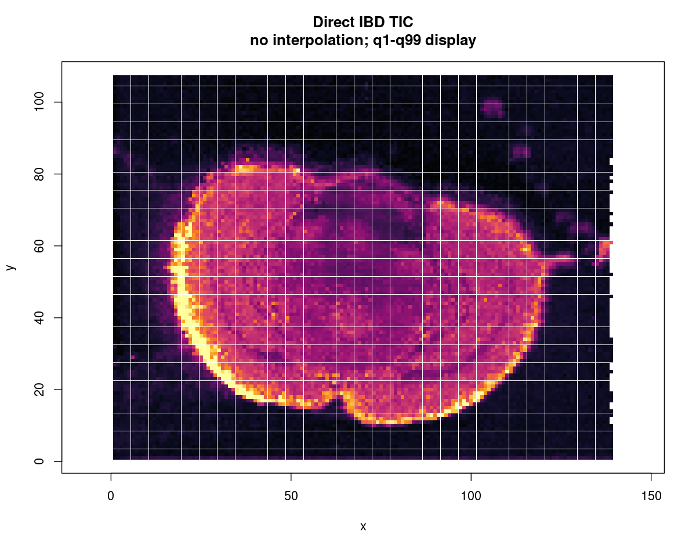
```

## Step 4: Spatial registration/context construction

For Brain01, the METASPACE API matrix maps relative MSI coordinates to optical
pixels. The origin `(82,340)` is derived from coordinate minima rather than
hard-coded. Both coordinate systems increase x rightward and y downward; no y
inversion is applied. The platform matrix uniquely maps the acquisition to the
third of five visible sections.

```{r brightfield, fig.cap="Original METASPACE optical brightfield. This is not relabelled as H&E."}
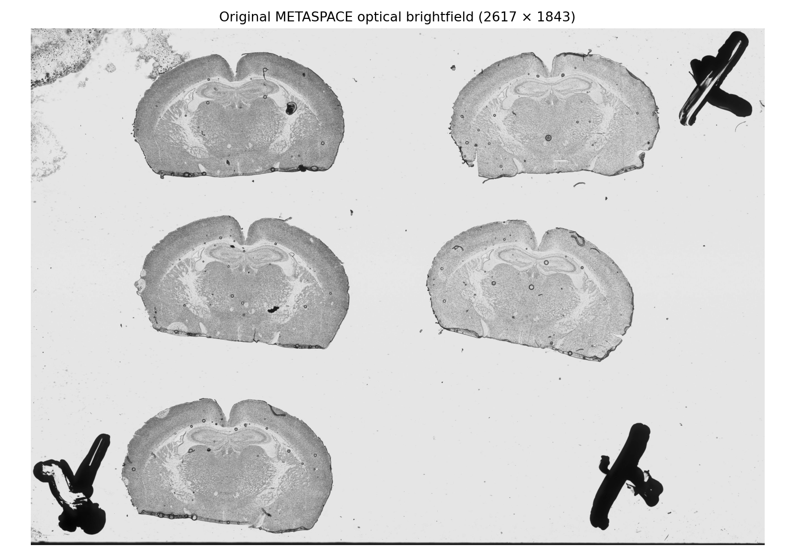
```

```{r registration, fig.cap="Live package-generated platform-transform measurement-mask overlay; no transform parameter was fitted manually."}
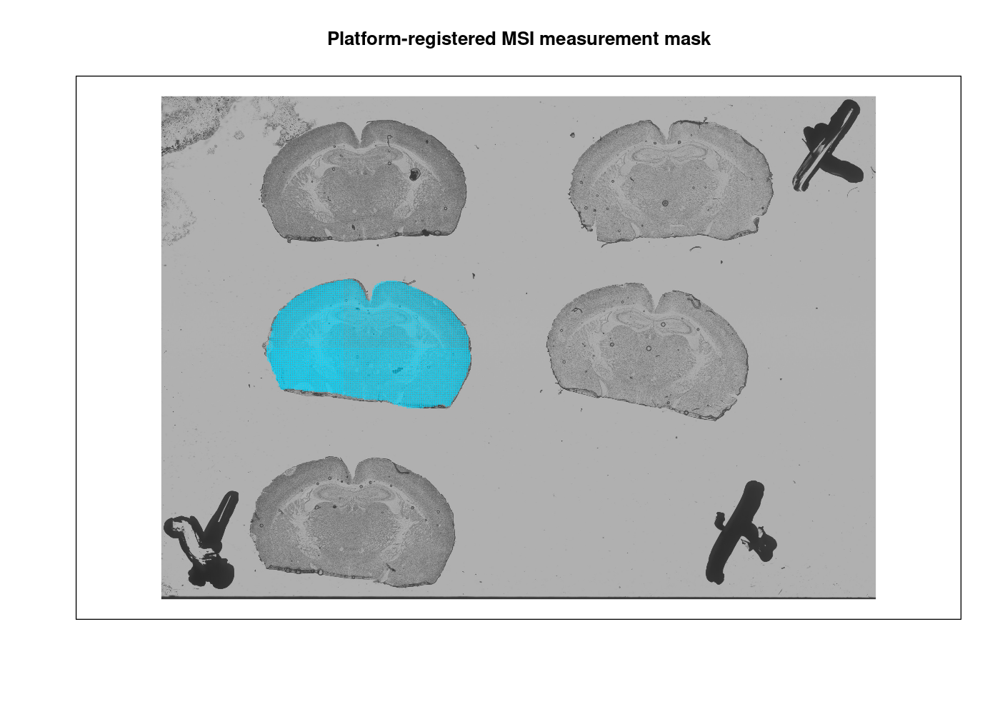
```

The symmetric boundary-distance diagnostic was 4.12 optical pixels at the median
and 15.52 pixels at the 95th percentile. A diagnostic forced y inversion reduced
Dice to 0.90168.

## Step 5: Standardized output generation

Each MSI run returns the same contract: `pixel_feature_matrix`, `coordinates`,
`feature_metadata`, `qc_summary`, `parameters`, and `provenance`. Parameters record
peak picking, SNR, ppm alignment, detection filtering, polarity source, software
versions and checksums. Shiny retains large matrices in its R session and exposes
only previews and downloadable standardized tables. Each browser session has an
independent temporary output directory.

# Data Analysis

## Task 1: Complete-brain ion visualization and QC

OMIX016317 was accepted because real intensity images show a closed, untruncated
mouse-brain section; it is not a coordinate-only or preselected-pixel claim.

```{r omix-mask, fig.cap="Data-derived OMIX016317 tissue/background mask used for QC, not an anatomical ROI."}
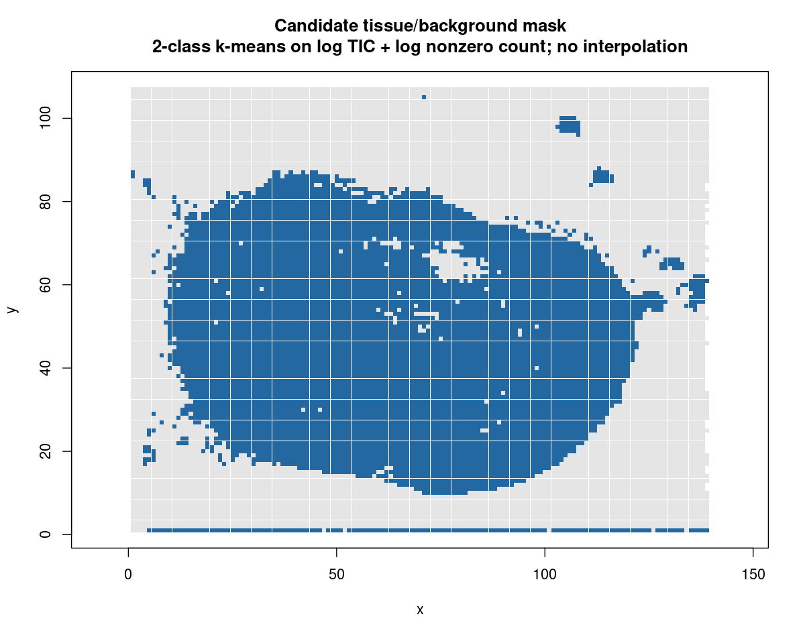
```

```{r omix-gate, fig.cap="Full acquisition field retained for QC (left) and the reproducible raw-TIC/peak-count tissue gate (right). Grey pixels remain unclassified/background."}
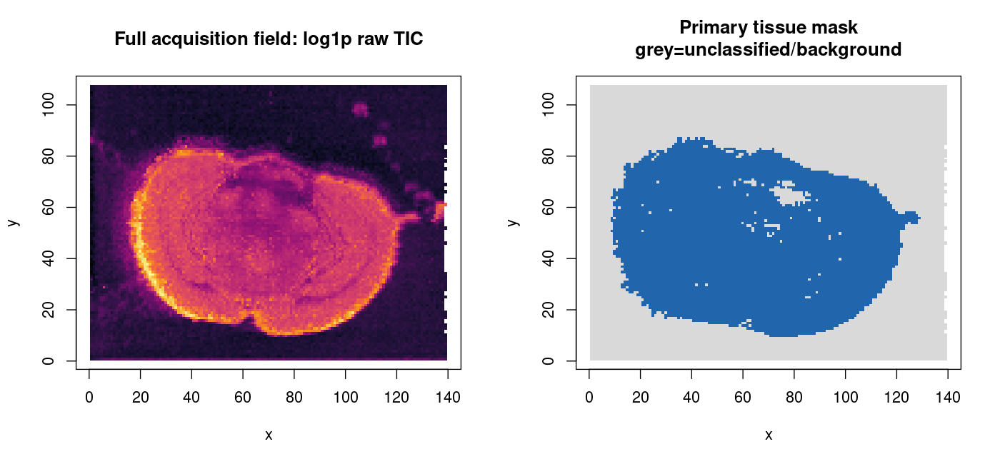
```

```{r omix-ion, fig.cap="Real OMIX016317 ion image at measured MSI m/z 775.55261535. No interpolation."}
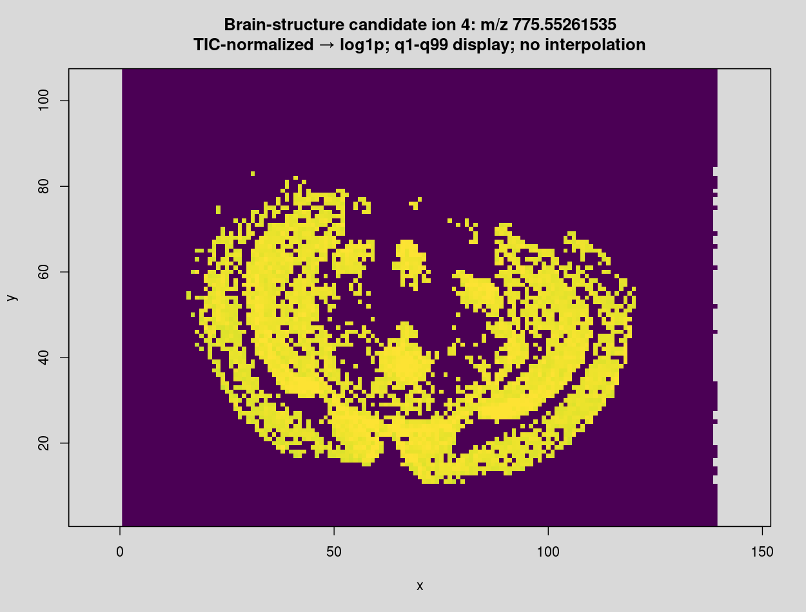
```

## Task 2: Brightfield–MSI registration and ROI transfer

The registered measurement mask, TIC and ion layers share the same platform
transform. Optical regions can therefore be transferred reproducibly, while their
origin remains optical context rather than a same-section molecular validation.

```{r brain01-tic, fig.cap="Live package-generated Brain01 TIC overlay using the METASPACE transform."}
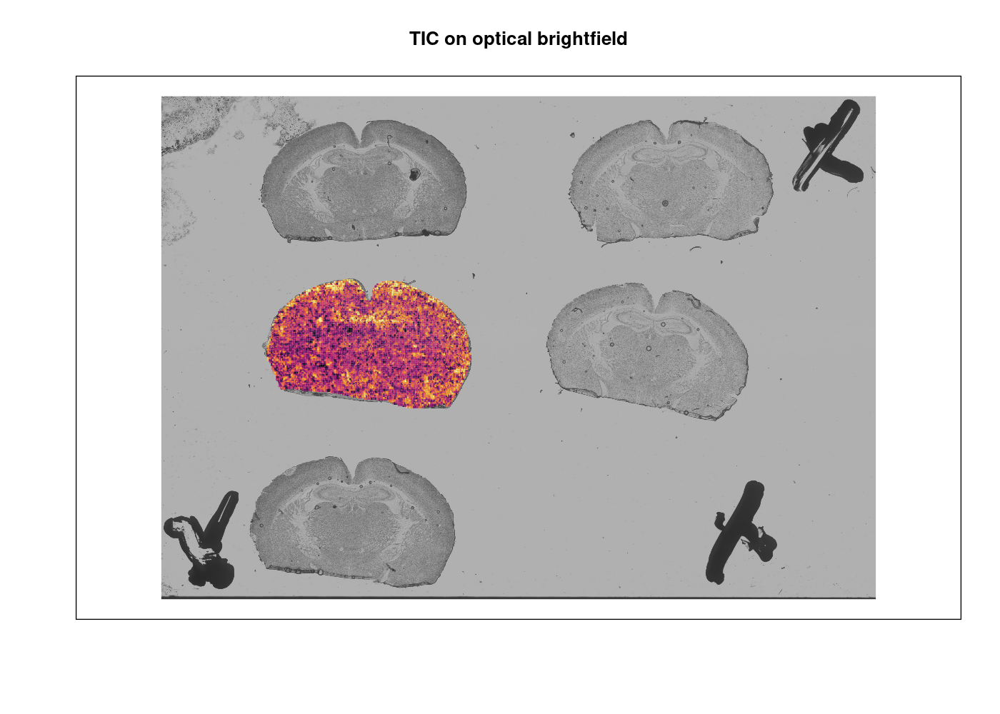
```

```{r brain01-ion, fig.cap="Live representative-ion overlay generated from the current Brain01 alignment."}
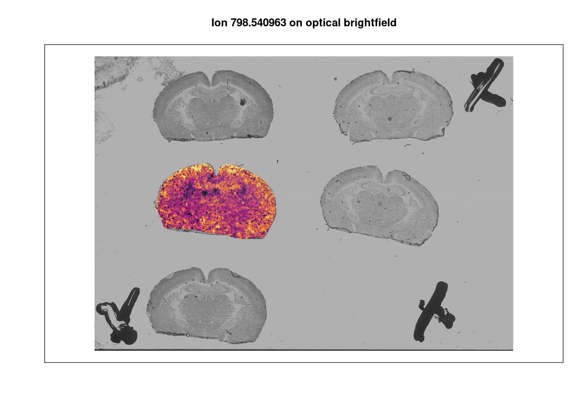
```

## Task 3: Spatially variable metabolite analysis with Queen/Rook sensitivity

The package constructs symmetric binary Queen or Rook graphs, reports edges,
isolates, effective N and connected components, and excludes isolates from the
Moran mean, denominator and permutations. The primary analysis uses 499 two-sided
permutations, fixed seed and BH-FDR; its minimum attainable permutation p-value is
0.002. Queen and Rook are reported together as a graph-sensitivity analysis.

The tissue-only OMIX016317 run used seed 20260808. The primary gate retained
6,589 of 14,822 scan pixels as the largest connected tissue component; 8,233
pixels remained unclassified/background. Queen contained 25,426 undirected
edges, 6,589 effective pixels and no isolates; Rook contained 12,771 edges.
Two score-threshold sensitivity gates retained 6,969 and 6,379 tissue pixels.
Their Queen Moran rankings correlated 0.99416 and 0.99405 with the primary gate,
showing that the ranking was not determined by one threshold alone.
All 196 features reached BH-FDR
<0.05 under both graphs. Tissue-only Queen/Rook rankings had Spearman correlation
0.99582, overlap 196 and Jaccard 1.0.
Results at p=0.002 reached the permutation resolution
limit and are not interpreted as exact zero probabilities.

```{r omix-moran, fig.cap="Real OMIX016317 Queen Moran ranking; red denotes BH-FDR <0.05. TIC normalization, log10(x + 1) and 499 two-sided permutations."}
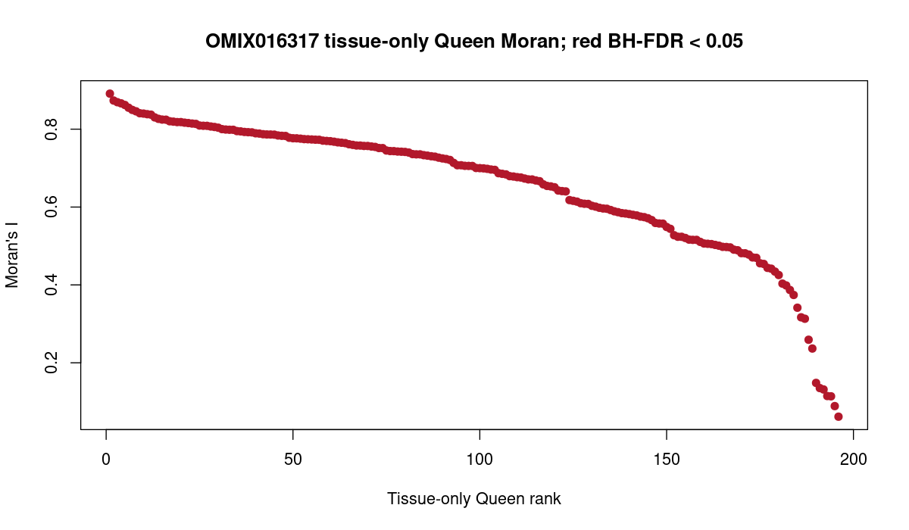
```

```{r omix-top-moran, fig.cap="Top real Queen Moran ion image, measured pixels only."}
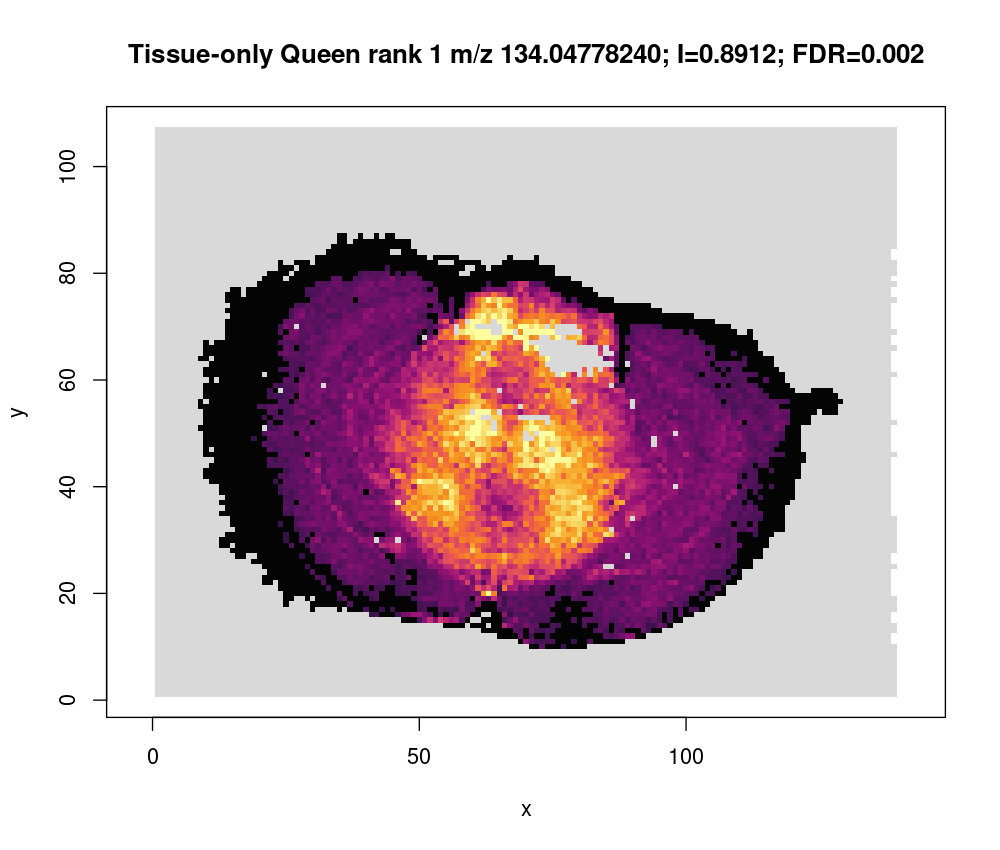
```

Data-driven metabolic domains, when supplied, remain distinct from anatomical ROI.
Label -1 is `unclassified/background`. Pixel-level domains are not treated as
biological replicates.

An exploratory k=4 PCA/k-means characterization was run only on tissue pixels
(10 PCs, seed 20260808), explained 79.02% of variance and produced domain pixel
counts 1,774, 348, 3,851 and 616; all 8,233 background pixels remain label -1.
These are descriptive data-driven exploratory metabolic domains; this single
section does not support inferential domain DE.

```{r omix-domains, fig.cap="OMIX016317 data-driven exploratory metabolic domains; not anatomical regions and no pixel-level inferential DE."}
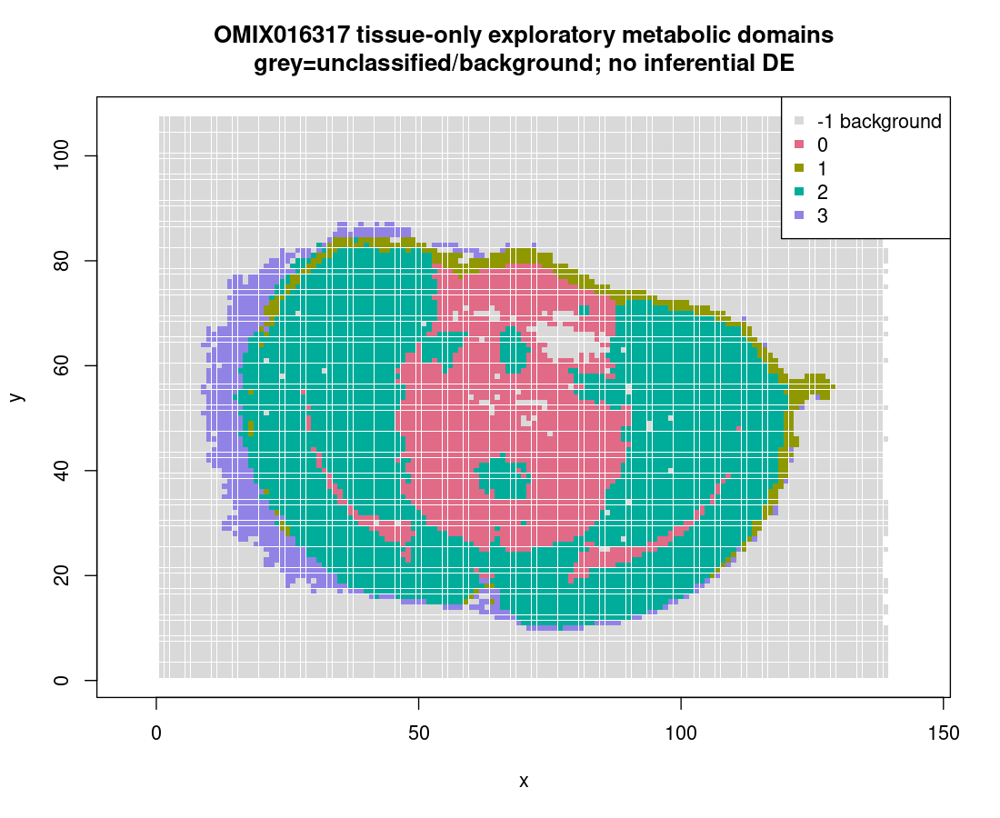
```

## Task 4: LC-MS/MS precursor/fragment orthogonal support

The OMIX MSI feature m/z 775.55261535 differs from the demonstration LC-MS/MS
reference precursor 775.550137928655 by 3.19 ppm. In MSV000090179, the positive
file contains an MS2 scan at selected precursor 775.5478 (RT 46.86465 min,
collision energy 30, isolation window ±0.5), and the negative file contains an MS2
scan at 775.5501 (RT 32.54018 min, collision energy 30, isolation window ±0.5).

```{r pos-fragments, fig.cap="Positive-mode unassigned fragment spectrum. It is displayed without diagnostic-ion or structural claims."}
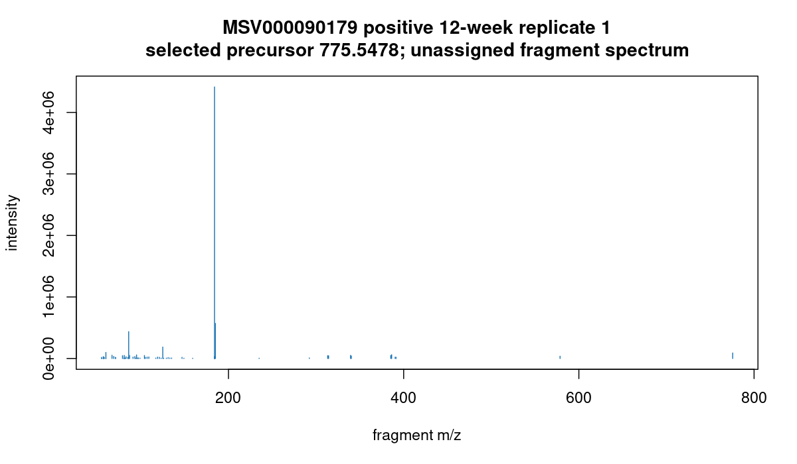
```

```{r neg-fragments, fig.cap="Negative-mode unassigned fragment spectrum from the independent companion dataset."}
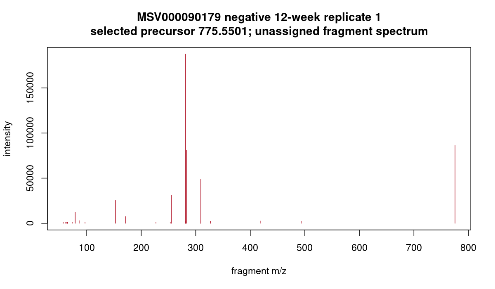
```

These data provide precursor-level and fragment-spectrum **orthogonal support**.
No diagnostic-ion definition has been supplied for this target, so the workflow
does not assign a chemical structure and does not emit `confirmed`, `validated
structure`, or `independent structural confirmation`. The LC-MS/MS samples are not
pixel matched or same-sample paired to either MSI dataset.

## Multimodal label paths for niche analysis

The package accepts three label paths through one validated structure:

1. Spatial-transcriptomics NNLS provides soft cell-type composition estimates.
   For multi-cell spots, retain these proportions and call
   `compute_neighborhood_composition_soft()`; a dominant hard label discards
   mixture information. The cosine option is an exploratory label-transfer
   score and is not a cell-fraction estimate.
2. Pure-R EBImage watershed segmentation followed by morphology-feature
   k-means produces `morphology_class_*` nuclear classes. These define
   exploratory **histomorphology niches**, not biological cell-type niches.
   Global luminance Otsu thresholding is a baseline whose mask, size filtering,
   and registration must be visually checked for each staining batch.
3. Precomputed external labels can be validated with
   `prepare_cell_type_labels()` and transferred using exact shared coordinates
   or a region-restricted nearest neighbor. Nearest-neighbor transfer requires
   an explicit maximum distance and, for histology coordinates, a fitted
   histology-to-MSI registration with reported residual error.

All three paths retain source, entity, coordinate-system, confidence, matching
distance, and section provenance. They should be compared as sensitivity or
complementary evidence; agreement is not independent validation when the paths
share a registration, tissue image, or reference atlas.

Neighborhood enrichment answers a separate, global question: whether pairs of
hard labels have more or fewer graph adjacencies than expected after labels are
permuted within section. It does not assign a niche to each position.

```r
enrichment <- compute_neighborhood_enrichment(
  cell_type_labels = typed_pixels$cell_type,
  neighbors = neighbors,
  region_id = typed_pixels$section_id,
  n_perm = 1000,
  seed = 1
)
enrichment$pair_table
```

`group_cell_types_from_enrichment()` may organize the heatmap by similarity of
complete z-score profiles. Its output is an interaction-profile grouping, not a
replacement for Schurch-style composition-vector niches. Undefined z-scores
from zero-variance permutation nulls remain `NA` by default and must not be
silently interpreted as zero enrichment.

## Distance-to-domain gradients

Distance analysis requires explicit topology increments, physical resolution,
units, ring construction, component handling, and domain provenance. Topology
is constructed from grid coordinates; physical coordinates are used only for
the metric. This prevents changing the neighbor graph when grid coordinates are
converted to micrometres.

```r
gradient <- analyze_distance_gradient(
  pixel_matrix = typed_pixels,
  domain_column = "roi_id",
  target_domain = "roi_cluster_1",
  ring_method = "fixed_breaks",
  ring_breaks = c(0, 50, 100, 200, 400),
  x_resolution = 50,
  y_resolution = 50,
  topology_x_step = 1,
  topology_y_step = 1,
  distance_unit = "um",
  domain_source_features = character(0), # only if independently defined
  section_column = "section_id",
  subject_column = "biological_subject_id",
  analysis_mode = "population_subject"
)
```

Population models use subject-by-section-by-ring profiles, never raw pixels.
Pixel-level GAMs are available as descriptive curves and deliberately return no
p-value. The observed-grid perimeter includes acquisition edges, holes, and
missing coordinates and is not automatically a biological tissue outline.
Features used to construct a metabolic domain cannot be tested as independent
distance-gradient discoveries unless circular analysis is explicitly enabled
and described as such.

## Gaussian spatial mixed-effects region analysis

For approximately Gaussian transformed subregion intensities, the spatial LMM
uses nested subject/section random intercepts and confines residual spatial
correlation to each subject-section field. Subregion center coordinates and
their physical unit must be supplied explicitly. Repeated coordinates within a
field are rejected rather than randomly jittered.

```r
spatial_lmm <- differential_region_analysis_spatial_lmm(
  sample_matrix = subregion_matrix,
  group_column = "roi_id",
  subject_column = "biological_subject_id",
  section_column = "section_id",
  x_col = "x_center",
  y_col = "y_center",
  x_resolution = 50,
  y_resolution = 50,
  distance_unit = "um",
  correlation_structure = "exponential"
)
```

The spatial marginal group test is omnibus; `contrasts` reports pairwise fixed
effects and confidence intervals. The corresponding independence LMM and
AIC/BIC differences are sensitivity summaries, not a regular likelihood-ratio
test proving spatial autocorrelation. This is a Gaussian spatial LMM, not a
binomial, count, zero-inflated, or other non-Gaussian GLMM.

# Scientific limitations

- Dataset 1 begins from processed sparse peak lists; it is not raw profile peak picking.
- Dataset 2 processing parameters are package-defined and do not reproduce the paper's feature table.
- Spatial domains are data-driven, not anatomical ROI, unless independently transferred from optical context.
- Accurate-mass relationships are putative and do not establish structure.
- The three datasets validate complementary modules only and cannot support a joint biological conclusion.

<details><summary>Session information</summary>

```{r session-info}
sessionInfo()
```

</details>
